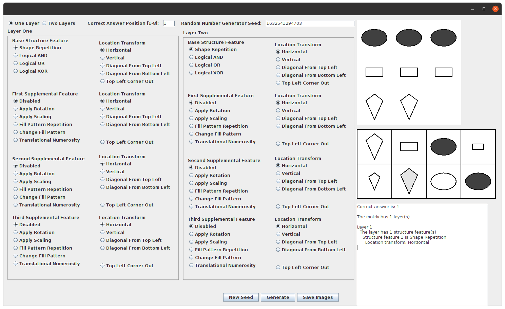

# Pre-requisites

This project is built with `ant` and `java`. Make sure `ant` is installed on your system. For Ubuntu systems, this is 
usually as easy as:
```
$ sudo apt install openjdk-11-jdk
$ sudo apt install ant
```

# Build with Ant

From the root directory of the project (where `./build.xml` exists), run `ant`:

```
$ ant
Buildfile: /home/bugaloo/git/Matrices/build.xml

-pre-init:

-init-private:

[...]

BUILD SUCCESSFUL
Total time: 2 seconds

```

# Run the executable JAR
Note the output of the `do-jar-with-libraries` step:

```
-do-jar-with-libraries:
 [copylibs] Copy libraries to /home/bugaloo/git/Matrices/Distribution/lib.
 [copylibs] Building jar: /home/bugaloo/git/Matrices/Distribution/gov-sandia-cognition-generator-matrix.jar
     [echo] To run this application from the command line without Ant, try:
     [echo] java -jar "/home/bugaloo/git/Matrices/Distribution/gov-sandia-cognition-generator-matrix.jar"

```

Following those instructions, you should be able to execute the jar it created to launch the GUI application:

```
java -jar "/home/bugaloo/git/Matrices/Distribution/gov-sandia-cognition-generator-matrix.jar"
```

